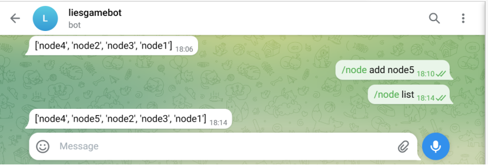
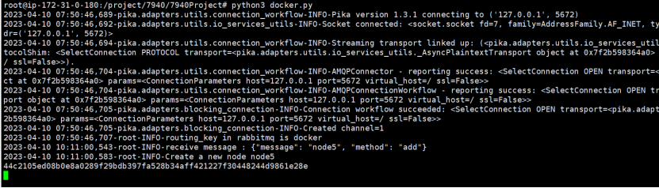

# 7940 Project

## build

Firstly, run part1

```cmd
docker-compose -f part1.yml up
```

After part1 up successfully

```cmd
docker-compose -f part2.yml up
```


update a new follow node

```cmd
docker run --name node4 --net 7940 liesgame/chatbot python chatbot.py --config docker_config.ini --ip node4
```

the name should be different other container, and it must be same as the ip

-- net should be same as the network in docker compose


OR we can run the docker.py to leverage telegarm control the nodes

```python
python3 docker.py 
```





[liesgame/chatbot - Docker Image | Docker Hub](https://hub.docker.com/r/liesgame/chatbot)